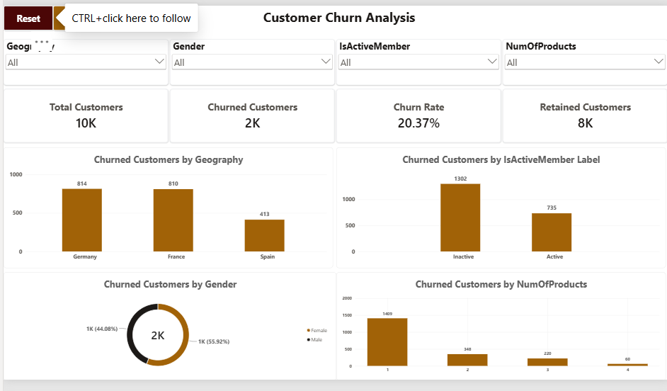
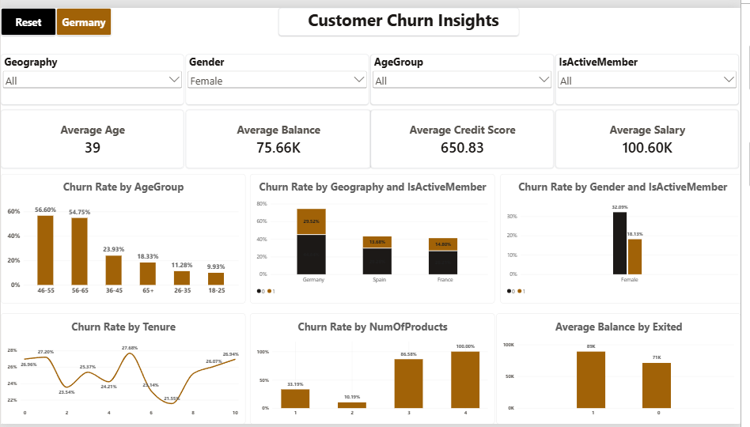
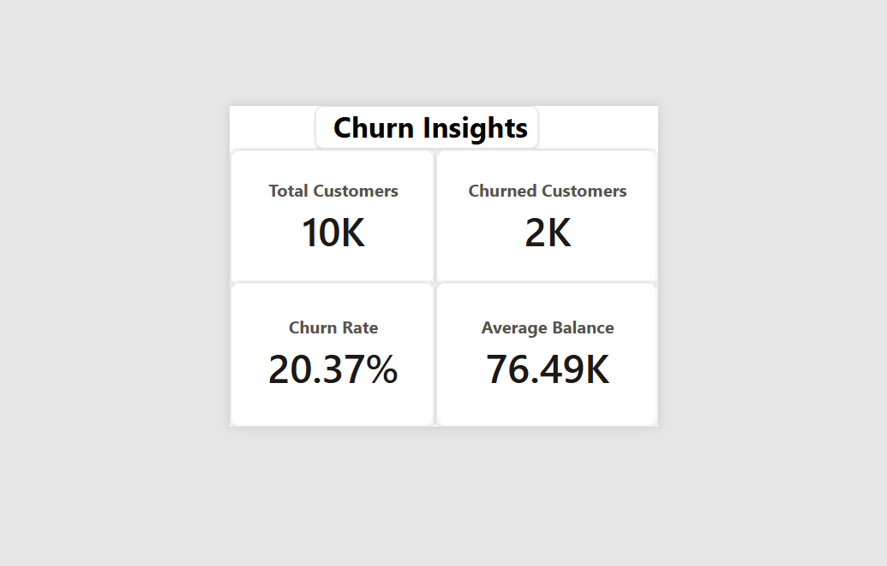

# Customer Churn Analysis

An end-to-end Data Analyst project using **SQL, Python, Statistical Analysis, and Power BI** to analyze customer churn patterns and identify customer segments with relatively higher and lower churn rates.

---

## Project Overview

Customer churn is an important business problem for banks and financial institutions because losing existing customers can impact revenue and customer retention.

This project analyzes customer-level banking data to understand the patterns associated with customer churn.

The analysis combines:

- **Python** for Exploratory Data Analysis (EDA)
- **SQL** for structured customer segmentation and churn analysis
- **Statistical Analysis** for testing relationships and differences
- **Power BI** for interactive dashboard development and visualization

The project focuses on **descriptive and diagnostic analytics** rather than machine learning or prediction.

## Customer Churn Overview


## Detailed Churn Analysis


## Business Objective

The main objective is to understand:

- The overall customer churn rate
- Which geography has the highest and lowest churn
- Whether gender is associated with churn
- Whether active or inactive customers have higher churn
- How churn varies by number of products
- Which age groups have higher churn
- Whether churned customers have different balances than retained customers
- Whether credit scores differ between churned and retained customers
- Whether tenure is associated with churn
- Whether credit card ownership is associated with churn
- Whether estimated salary differs between churned and retained customers

The analysis helps identify customer segments that may require further investigation for retention-focused strategies.

---

# 🗂️ Dataset

The project uses the **Churn Modelling dataset**, containing customer-level banking information.

### Dataset Size

- **10,000 customers**
- **14 columns**
- No missing values in the dataset
- Target variable: `Exited`

### Target Variable

| Value | Meaning |
|---|---|
| `0` | Customer Retained |
| `1` | Customer Churned |

### Important Columns

| Column | Description |
|---|---|
| CustomerId | Unique customer identifier |
| Surname | Customer surname |
| CreditScore | Customer credit score |
| Geography | Customer country |
| Gender | Customer gender |
| Age | Customer age |
| Tenure | Number of years as a customer |
| Balance | Customer account balance |
| NumOfProducts | Number of products used by the customer |
| HasCrCard | Whether the customer has a credit card |
| IsActiveMember | Whether the customer is an active member |
| EstimatedSalary | Estimated customer salary |
| Exited | Customer churn indicator |

---

# 🛠️ Tools & Technologies

## SQL
- MySQL
- SELECT statements
- WHERE conditions
- GROUP BY
- Aggregate functions
- CASE statements
- Conditional calculations
- Customer segmentation
- Churn rate analysis

## Python
- Python
- Pandas
- Matplotlib
- Exploratory Data Analysis
- Descriptive statistics
- Group-based analysis

## Statistical Analysis
- Chi-Square Test
- Mann-Whitney U Test
- P-value interpretation
- Statistical significance testing

## Power BI
- Power BI Desktop
- DAX
- Power Query
- Data Modeling
- Calculated Columns
- Measures
- Interactive Slicers
- Drill-through
- Dynamic Titles
- Report Page Tooltip

---

# 🔄 Project Workflow

The project followed an end-to-end Data Analyst workflow:

```text
Raw Dataset
     ↓
Data Understanding
     ↓
Python Exploratory Data Analysis
     ↓
Statistical Analysis
     ↓
SQL Analysis
     ↓
Power BI Data Modeling
     ↓
Interactive Dashboard
     ↓
Business Insights
```

---

# 🐍 Python Exploratory Data Analysis

Python was used to explore the dataset and understand customer churn patterns.

### Analysis Performed

- Overall churn distribution
- Churn rate calculation
- Churn by geography
- Churn by gender
- Churn by active membership
- Churn by number of products
- Churn by credit card ownership
- Churn by tenure
- Age comparison
- Balance comparison
- Credit score comparison
- Estimated salary comparison
- Age-group analysis
- Group-based churn analysis

### Overall Churn Distribution

- Retained customers: **7,963**
- Churned customers: **2,037**
- Overall churn rate: **20.37%**

---

# 🗄️ SQL Analysis

MySQL was used to perform structured analysis and validate the customer churn findings.

The SQL analysis included:

1. Total customers, churned customers and retained customers
2. Overall churn rate
3. Churn by geography
4. Churn by gender
5. Churn by active membership
6. Churn by number of products
7. Churn by credit card ownership
8. Churn by tenure
9. Average age, balance, credit score and salary by churn status
10. Churn by age group
11. Geography and active membership analysis

The SQL queries used for the analysis are available in:

`Customer_Churn_Analysis.sql`

---

# 📈 Statistical Analysis

Statistical tests were performed to determine whether the observed relationships and differences between churned and retained customers were statistically significant.

## Chi-Square Test

The Chi-Square test was used for categorical variables.

### Statistically Significant Relationships

- Geography
- Gender
- IsActiveMember
- NumOfProducts

### Not Statistically Significant

- HasCrCard
- Tenure

---

## Mann-Whitney U Test

The Mann-Whitney U test was used for numerical variables.

### Statistically Significant Differences

- Age
- Balance
- CreditScore

### Not Statistically Significant

- EstimatedSalary

Statistical significance indicates an association or difference between groups. It does **not** prove that a variable directly causes customer churn.

---

# 📊 Power BI Dashboard

The analysis was transformed into an interactive Power BI dashboard consisting of four pages.

---

## 1. Customer Churn Overview

The overview page provides a high-level summary of customer churn.

### KPIs

- Total Customers
- Churned Customers
- Churn Rate
- Retained Customers

### Visualizations

- Churned Customers by Geography
- Churned Customers by Gender
- Churned Customers by Active Status
- Churned Customers by Number of Products

### Filters

- Geography
- Gender
- IsActiveMember
- NumOfProducts

---

## 2. Detailed Churn Analysis

This page provides deeper analysis of churn patterns.

### KPIs

- Average Age
- Average Balance
- Average Credit Score
- Average Salary

### Visualizations

- Churn Rate by Age Group
- Churn Rate by Geography and Active Membership
- Churn Rate by Gender and Active Membership
- Churn Rate by Tenure
- Churn Rate by Number of Products
- Average Balance by Churn Status

### Filters

- Geography
- Gender
- Age Group
- IsActiveMember

---

## 3. Customer Details

This page provides customer-level details and supports drill-through analysis.

### Customer Information

- Customer ID
- Surname
- Geography
- Gender
- Age
- Credit Score
- Balance
- Number of Products
- Active Membership
- Estimated Salary
- Churn Status

---

## 4. Churn Insights Tooltip

A custom Power BI Report Page Tooltip was created to display important churn KPIs while interacting with dashboard visuals.

### Tooltip KPIs

- Total Customers
- Churned Customers
- Churn Rate
- Average Balance

---

# 🧮 Power BI Data Model

The Power BI model contains a main customer fact table and a geography dimension.

### Fact Table

`FactCustomer`

Contains customer-level information used for analysis.

### Dimension Table

`DimGeography`

Contains unique geography values used for filtering and analysis.

### Relationship

```text
DimGeography
     │
     │ 1 : *
     ↓
FactCustomer
```

The model uses a single-direction relationship from `DimGeography` to `FactCustomer`.

---

# 📌 Key DAX Measures

### Total Customers

```DAX
Total Customers =
COUNTROWS(FactCustomer)
```

### Churned Customers

```DAX
Churned Customers =
CALCULATE(
    COUNTROWS(FactCustomer),
    FactCustomer[Exited] = 1
)
```

### Retained Customers

```DAX
Retained Customers =
CALCULATE(
    COUNTROWS(FactCustomer),
    FactCustomer[Exited] = 0
)
```

### Churn Rate

```DAX
Churn Rate =
DIVIDE(
    [Churned Customers],
    [Total Customers],
    0
)
```

Additional measures were created for:

- Average Age
- Average Balance
- Average Credit Score
- Average Salary
- Dynamic chart titles

---

# 💡 Key Insights

The following insights are based on the actual Python, SQL and statistical analysis performed on the dataset.

---

## 1. Overall Churn

Out of **10,000 customers**:

| Customer Status | Customers |
|---|---:|
| Retained | **7,963** |
| Churned | **2,037** |
| Total | **10,000** |

### Finding

The overall customer churn rate was **20.37%**.

This means approximately **1 in every 5 customers** in the dataset had churned.

---

# 🌍 2. Churn by Geography

| Geography | Churn Rate |
|---|---:|
| Germany | **32.44%** |
| Spain | **16.67%** |
| France | **16.15%** |

### Finding

**Germany had the highest churn rate at 32.44%.**

**France had the lowest churn rate at 16.15%.**

Germany's churn rate was almost twice the churn rate observed in France.

The Chi-Square test also showed a statistically significant association between Geography and Churn.

---

# 👩 3. Churn by Gender

| Gender | Churn Rate |
|---|---:|
| Female | **25.07%** |
| Male | **16.46%** |

### Finding

**Female customers had higher churn than male customers.**

- Female: **25.07%**
- Male: **16.46%**

The Chi-Square test showed a statistically significant association between Gender and Churn.

---

# 🟢 4. Churn by Customer Activity

| Customer Status | Churn Rate |
|---|---:|
| Inactive | **26.85%** |
| Active | **14.27%** |

### Finding

**Inactive customers had substantially higher churn than active customers.**

- Inactive: **26.85%**
- Active: **14.27%**

The churn rate among inactive customers was almost twice that of active customers.

The Chi-Square test showed a statistically significant association between IsActiveMember and Churn.

---

# 📦 5. Churn by Number of Products

| Number of Products | Churn Rate |
|---|---:|
| 1 Product | **7.58%** |
| 2 Products | **27.71%** |
| 3 Products | **82.71%** |
| 4 Products | **100.00%** |

### Finding

**Customers with 1 product had the lowest churn rate at 7.58%.**

Customers with 2 products had a higher churn rate of **27.71%**.

The churn rate was extremely high among customers with 3 and 4 products.

However, the 3-product and 4-product groups contain relatively fewer customers, so these percentages should be interpreted carefully.

The Chi-Square test showed a statistically significant association between Number of Products and Churn.

---

# 🎂 6. Churn by Age Group

| Age Group | Churn Rate |
|---|---:|
| 18–25 | **7.53%** |
| 26–35 | **8.50%** |
| 36–45 | **19.62%** |
| 46–55 | **50.57%** |
| 56–65 | **48.32%** |
| 65+ | **13.26%** |

### Finding

**The 46–55 age group had the highest churn rate at 50.57%.**

The **56–65 age group also had a very high churn rate of 48.32%.**

The **18–25 age group had the lowest churn rate at 7.53%.**

The Mann-Whitney U test showed a statistically significant difference in Age between churned and retained customers.

---

# 👴 7. Average Age: Churned vs Retained

| Customer Status | Average Age |
|---|---:|
| Retained | **37.41 years** |
| Churned | **44.84 years** |

### Finding

**Churned customers were older on average than retained customers.**

The average age difference was approximately **7.43 years**.

---

# 💰 8. Average Balance: Churned vs Retained

| Customer Status | Average Balance |
|---|---:|
| Retained | **72,745.30** |
| Churned | **91,108.54** |

### Finding

**Churned customers had a higher average balance than retained customers.**

The Mann-Whitney U test showed a statistically significant difference in Balance between churned and retained customers.

---

# 📊 9. Credit Score: Churned vs Retained

| Customer Status | Average Credit Score |
|---|---:|
| Retained | **651.85** |
| Churned | **645.35** |

### Finding

**Churned customers had a slightly lower average credit score than retained customers.**

The Mann-Whitney U test showed a statistically significant difference in Credit Score between the two groups.

---

# 💵 10. Estimated Salary: Churned vs Retained

| Customer Status | Average Estimated Salary |
|---|---:|
| Retained | **99,738.39** |
| Churned | **101,465.68** |

### Finding

Churned customers had a slightly higher average estimated salary.

However, the Mann-Whitney U test did **not** show a statistically significant difference in Estimated Salary.

Therefore, estimated salary did not show a statistically significant difference between churned and retained customers in this analysis.

---

# 💳 11. Credit Card Ownership

The Chi-Square test produced a p-value of:

**0.492372**

### Finding

Credit card ownership did **not** show a statistically significant association with customer churn.

Therefore, having a credit card did not appear to be a statistically significant churn-related factor in this dataset.

---

# 📅 12. Tenure

The Chi-Square test produced a p-value of:

**0.177585**

### Finding

Tenure did **not** show a statistically significant association with customer churn.

The churn rates across different tenure values were relatively similar compared with the stronger differences observed for variables such as geography, activity and age.

---

# 🏆 Highest vs Lowest Churn

The most important churn comparisons are summarized below:

| Category | Highest Churn | Lowest Churn |
|---|---|---|
| Geography | **Germany – 32.44%** | **France – 16.15%** |
| Gender | **Female – 25.07%** | **Male – 16.46%** |
| Activity | **Inactive – 26.85%** | **Active – 14.27%** |
| Products | **4 Products – 100%** | **1 Product – 7.58%** |
| Age Group | **46–55 – 50.57%** | **18–25 – 7.53%** |

> **Note:** The 3-product and 4-product groups have relatively smaller customer counts, so their extremely high churn percentages should be interpreted carefully.

---

# 💼 Business Takeaways

Based on the observed data, the customer segments with relatively higher churn include:

### Higher Churn

- **Germany:** 32.44%
- **Inactive members:** 26.85%
- **Female customers:** 25.07%
- **46–55 age group:** 50.57%
- **56–65 age group:** 48.32%
- **Customers with 3 products:** 82.71%
- **Customers with 4 products:** 100%

### Lower Churn

- **France:** 16.15%
- **Active members:** 14.27%
- **Male customers:** 16.46%
- **18–25 age group:** 7.53%
- **Customers with 1 product:** 7.58%

These segments can be used as starting points for further customer retention investigation.

---

# ⚠️ Important Statistical Interpretation

The analysis identifies **associations and differences**, not direct causes of churn.

For example:

- Inactive customers have a higher churn rate, but this analysis does not prove that inactivity causes churn.
- Germany has a higher churn rate, but the analysis alone does not explain why.
- Older customers show higher churn, but age itself should not automatically be treated as the direct cause.
- Customers with 3 or 4 products show extremely high churn rates, but these groups have smaller customer counts and therefore require careful interpretation.

Additional business data would be required to determine the underlying causes and design targeted retention strategies.

---

# 🖼️ Dashboard Screenshots

## Customer Churn Overview


## Detailed Churn Analysis


## Customer Details


## Churn Insights Tooltip



---

# 📁 Project Structure

```text
Customer-Churn-Analysis/
│
├── README.md
│
├── Customer_Churn_Analysis.sql
│
├── customer_churn_dashboard.pbix
│
├── overview.png
├── Churn-Insights.png
├── Customer-Details.png
└── Churn-Tooltip.png
```

---

# 🚀 Project Outcome

This project demonstrates an end-to-end **Data Analyst workflow**:

- Data understanding
- Exploratory Data Analysis
- SQL analysis
- Statistical testing
- Customer segmentation
- Data modeling
- DAX measures
- Interactive Power BI dashboard
- Business insight generation

The analysis identified meaningful differences in churn across **geography, gender, customer activity, number of products and age groups**.

It also identified variables such as **credit card ownership, tenure and estimated salary** that did not show statistically significant relationships or differences in this analysis.

---

# 👨‍💻 Skills Demonstrated

- SQL
- MySQL
- Python
- Pandas
- Matplotlib
- Exploratory Data Analysis
- Descriptive Statistics
- Statistical Analysis
- Chi-Square Test
- Mann-Whitney U Test
- Power BI
- DAX
- Power Query
- Data Modeling
- Data Visualization
- Customer Segmentation
- Business Analysis
- Dashboard Development
